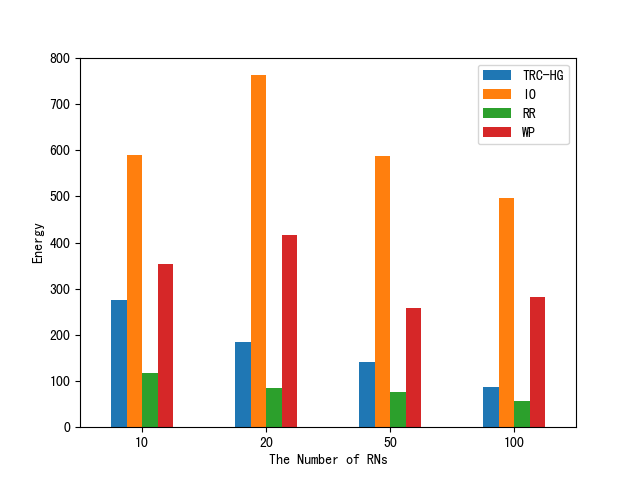
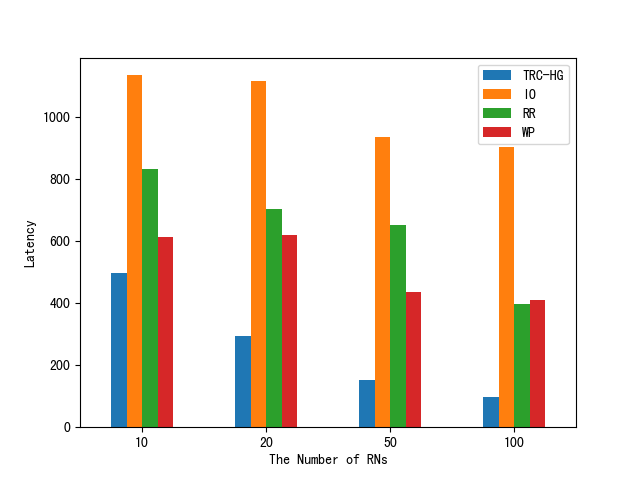
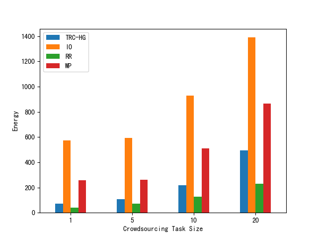
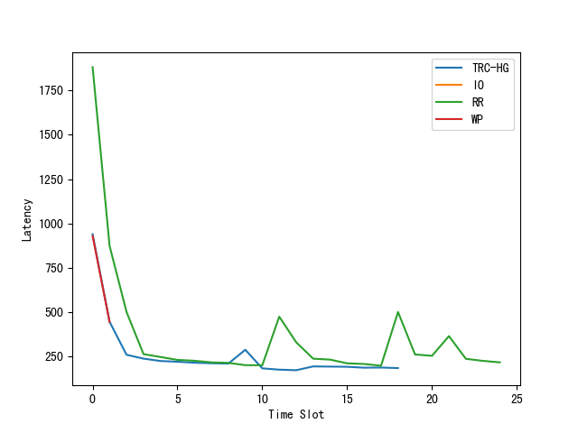
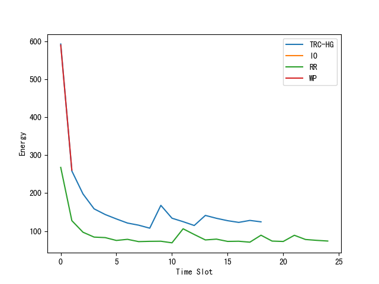

# TCRC

## Quick Start

### 一、[安装simhei字体](https://blog.csdn.net/BIT_666/article/details/122365074)以显示中文

### 二、运行
```shell
#安装依赖
pip install -r requirements.txt

python opm.py # 运行
```

## Preview







